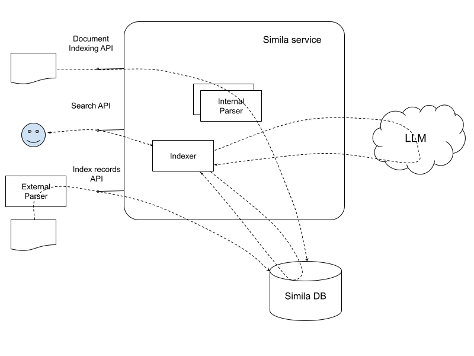

# Core concepts
The section describes the objects' model and the concepts that are used in Simila.

## Objects

### Document
A document is a BLOB object that should be parsed and available for the text search. The documents may be a structured or unstructured data encoded and represented in its specific format - plain text, Excel spreadsheet, Adobe pdf file, mp3 file, etc.

Simila doesn’t store the document data inside as is, but it may store some transformed data for indexing and query result purposes.

### Format
Format is a model, which describes a specific input document type in terms of the [basis](#basis) and its [dimensions](#dimension). The format is identified by the name - `"pdf”`, `“acme-sheet”` etc. 

#### Basis
A basis is a set of dimensions for a specific format.

For example, a `pdf` document can be split into pages (one dimension) and every page may contain paragraphs (another dimension). The `pdf` document format may be described on a basis with two dimensions - pages and paragraphs.

#### Dimension
Dimension is a scalar value, which helps to identify the position of text in a document in its [basis](#basis). For example, the page number may be one dimension of the `pdf` document and the paragraph on the page is another dimension for the format, etc.

#### Vector
A Vector is a set of scalar values of every dimension for a basis. For example, for a `pdf` document the text “Hello world!” in the basis `{page, paragraph}` may be `{1, 1}`, which means that the text resides on page one in the first paragraph of the document.

### Index
An index is a form of data transformed from the original document, and it's optimized for the full-text search. Every index is built for a document in the specific format, which identifies the [bais](#basis) of the vectors in the index records. Simila stores the index in its dedicated database. Each index contains a list of records associated with a unique index ID. Each index record stores the searchable text and the vector of the text based on the document format.

For instance, an mp3-encoded file contains the sound of a voice, which may be transcribed and represented as text spoken in the mp3 recording. The index will store the text available for search for the `mp3` format. Search results may be returned in the format: 'Hello world!' is spoken at 00:30 in the recording. 'Hello world' is the searchable text, and the timepoint '00:30' serves as the reference point (vector) where the text is spoken.

#### Index ID
Every index has ID (string up to 256 bytes long) which should be provided when the index is created.

#### Index format
Every index is built for a document with the specific format. Format identifies the basis in which the index records vectors will be defined.

#### Index record
Each index comprises records representing searchable fragments within the original document. Each record within an index includes the following fields:

- ID: A unique identifier for each index record, serving as its address within the index. The document [parser](#parser) should provide the index record ID when building the index from a document.
- Segment: This field contains the searchable text for the record.
- Vector: The vector is a set of coordinates that identify the position of the record segment in the original document. For example, for a `pdf` format in the basis will be `{page, paragraph}`, ao the vector will contain the two dimensions - page and paragraph. The records for the index of a `pdf` document will contain vectors like {1, 1}, {1, 2}, …{25, 8}. 

### Parser
A parser is a programming component, which transforms the original document data into the index with its records. The parser "knows" the structure and how the document's data is encoded - the document format. It parses the document according to its encoding format and builds the index records, extracting the searchable text, the index record IDs, and the index record vectors.

Parsers split into two groups - internal and external. The internal parser is the parser that comes with Simila. It consumes the original document data via Simila API, parses it, and creates the index and its records in the Simila database. External parsers are the programming components running independently, that parse the original documents and submit the index records to Simila DB via the Simila API.

### Tags
A tag is a `<key:value>` pair where the `key` and the `value` are text values. Tags are the list of pairs with unique keys. Tags may be applied to the indexes and then used in the queries for selecting some group of indexes.

## High-level design (in few words)
Simila highl-level design is depicted in the following diagram:

There are two main components there - Simila service and the Simila DB. 

The Simila service is an executable, which exposes API over gRPC or HTTP protocols. It accepts API calls and among other functions allows uploading a document, which will be parsed by an internal parser which is part of the Simila service, and indexing its data for search into the Simila DB. Another way to build an index is by using an external parser and inserting the index records using the Index API. Clients may use the search API for searching text over the built indexes.

The Simila DB is a storage that is used by Simila to store its indexed data and for the vector search (TBD). Initially, we propose to use Postgres for the purposes, but integrations with other services like ElasticSearch are also may be implemented.
