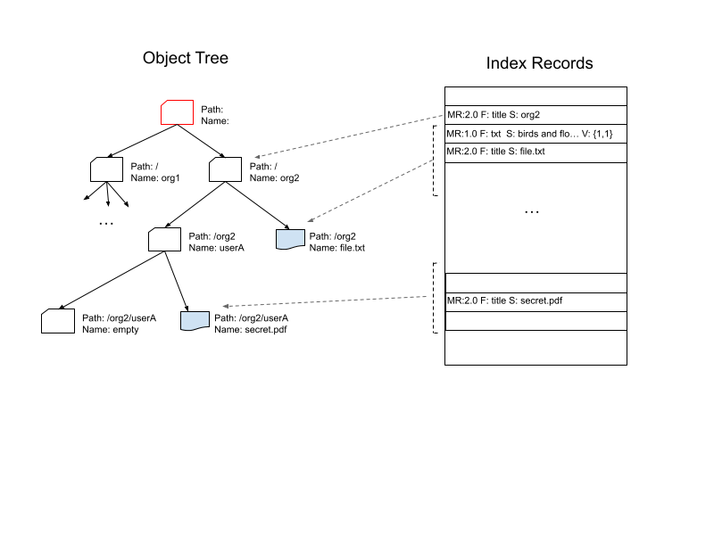

# Core concepts
The section describes the objects' model and the concepts that are used in Simila.

Simila provides full-text search functionality across different objects **documents** and some metadata related to the documents' relationships (document titles, summaries, organization structures, etc.).

To search by text, every searchable document should be represented in text form. Imagine a picture with a bird and flowers on it. To find the document using the text "bird with flowers," we need to represent the picture in the text form. The transformation of the initial document to the searchable form is done by a component - **parser**. The parser may be a part of Simila (plugin) or be an external programming component. In the second case, the parser will use Simila's API to provide the text representation of the document to the Simila DB.

All the searchable information is represented in the form of **index records**. An index record is a record in Simila's DB that describes some piece of information in text form. When we run the text search, the input phrase is compared against the index records, and the matched records will be returned as the search result.

Some index records may be more important than others. For example, the document title may have a higher priority than the content of the document, so every index record has a **Rank Multiplier** - a value that may increase the priority of the record in the search result compared to another, lower-priority record.

All index records are associated with **objects** organized into an **object tree**. Each **node** of the tree can be either a **folder** or a **document**. Folders may have children, while documents cannot. Every node has a **name** and can be addressed by a **path** from the root of the tree, which includes the names of the parent nodes, allowing the target node to be reached. Nodes can be tagged, allowing some nodes to be filtered during the search.

Even though the nodes in the object tree have names, the information is not searchable; however, the index records are. To search by the name of a node, an index record should be created and associated with the node. For example, to make a folder or a document name available in the search result, we need to create an index record containing the name of the node.

When running a search across the index records, we need to provide the path in the object tree to identify the subtree of nodes where we would like to run the search. Another tool for selecting specific nodes is **tags**. Tags can be included in the search query to select only specific (tagged or untagged) nodes and the records associated with them. Paths and tags are the tools to reduce the scope of the search across the index records. 

All the information above forms the object model is illustrated in the following picture:

When a **search** for a text is running Simila considers the Index Records (right part of the picture) for the path provided, tags filtering conditions etc. which are stored in the nodes (left side of the picture). 

## Terms and definitions

### Document
A document is a BLOB object that should be parsed and available for the text search. The documents may be a structured or unstructured data encoded and represented in its specific format - plain text, Excel spreadsheet, Adobe pdf file, mp3 file, etc.

Simila doesn’t store the document data inside as is, but it may store some transformed data for indexing and query result purposes.

### Format
Format is a model, which describes a specific index record in terms of the [basis](#basis) and its [dimensions](#dimension). The format is identified by the name - `"pdf”`, `“acme-sheet”` etc. Every index record refers to the format for the record. 

#### Basis
A basis is a set of dimensions for a specific format.

For example, a `pdf` document can be split into pages (one dimension) and every page may contain paragraphs (another dimension). The `pdf` document format may be described on a basis with two dimensions - pages and paragraphs.

#### Dimension
Dimension is a scalar value, which helps to identify the position of text in a document in its [basis](#basis). For example, the page number may be one dimension of the `pdf` document and the paragraph on the page is another dimension for the format, etc.

#### Vector
A Vector is a set of scalar values of every dimension for a basis. For example, for a `pdf` document the text “Hello world!” in the basis `{page, paragraph}` may be `{1, 1}`, which means that the text resides on page one in the first paragraph of the document.

### Node
The searcheable objects are organized into the object tree and the Node is the element of the tree which represents an object. Every node has the following properties:
- *type*: the node type, which could be either "document" or "folder". The "document" nodes are always leafs (they cannot have childrens). A folder node could be a leaf, or it can have children.
- *path*: the path to the node in the tree. The object tree root's children have path value "/"
- *name*: the node name
- *tags*: the [tags](#tags) associated with the node

### Index record
Each searchable text fragments of information is represented by the index record in Simila DB. Each of the record keeps the following information:
- *ID*: A unique identifier for each index record, serving as its address within the subset of recrods for the node. The document [parser](#parser) should provide the index record ID when building the index from a document.
- *FQNP*: Fully Qualified Node Path, which is the pair of <Path, Name> and identify the node, associated with the record. The field just a path to the node, for example: "/org1/userA/secret.pdf". Every record always has the node reference, so the field cannot be empty.  
- *Segment*: This field contains the searchable text for the record.
- *Vector*: The vector is a set of coordinates that identify the position of the record segment in the original document. For example, for a `pdf` format in the basis will be `{page, paragraph}`, ao the vector will contain the two dimensions - page and paragraph. The records for the index of a `pdf` document will contain vectors like {1, 1}, {1, 2}, …{25, 8}.
- *Format*: the record format. 
- *RM*: Rank Multiplier - defines the rank multiplier magnitude. The value is used to define the final record rank in the search result. During the search for every record the match score is calculated, and the final record RANK=RM*score 

The Index Records are the main source for the text search. They keep the text information in the *Segment*, the record *format*, and the "position" of the text within the original document in the *vector*. For instance, an mp3-encoded file contains the sound of a voice, which may be transcribed and represented as text spoken in the mp3 recording. The mp3 file parser will store the text available for search for the `mp3` format. Search results may be returned in the format: 'Hello world!' is spoken at 00:30 in the recording. 'Hello world' is the searchable text, and the timepoint '00:30' serves as the reference point (vector) where the text is spoken.

The Index Records maybe created for the meta-information available for the search. In the example above the mp3 file may have the "Birds and flowers" title. The parser would create a record with the "title" format which has "Birds and flowers" as the Segment field value. The record doesn't have vector (format defined), because only one title can exists for a document...

### Parser
A parser is a programming component, which transforms the original document data into the index with its records. The parser "knows" the structure and how the document's data is encoded - the document format. It parses the document according to its encoding format and builds the index records, extracting the searchable text, the index record IDs, and the index record vectors.

Parsers split into two groups - internal and external. The internal parser is the parser that comes with Simila. It consumes the original document data via Simila API, parses it, and creates the index and its records in the Simila database. External parsers are the programming components running independently, that parse the original documents and submit the index records to Simila DB via the Simila API.

### Tags
A tag is a `<key:value>` pair where the `key` and the `value` are text values. Tags are the list of pairs with unique keys. Tags may be applied to the indexes and then used in the queries for selecting some group of indexes.

## High-level design (in few words)
Simila highl-level design is depicted in the following diagram:

There are two main components there - Simila service and the Simila DB. 

The Simila service is an executable, which exposes API over gRPC or HTTP protocols. It accepts API calls and among other functions allows uploading a document, which will be parsed by an internal parser which is part of the Simila service, and indexing its data for search into the Simila DB. Another way to build an index is by using an external parser and inserting the index records using the Index API. Clients may use the search API for searching text over the built indexes.

The Simila DB is a storage that is used by Simila to store its indexed data and for the vector search (TBD). Initially, we propose to use Postgres for the purposes, but integrations with other services like ElasticSearch are also may be implemented.
